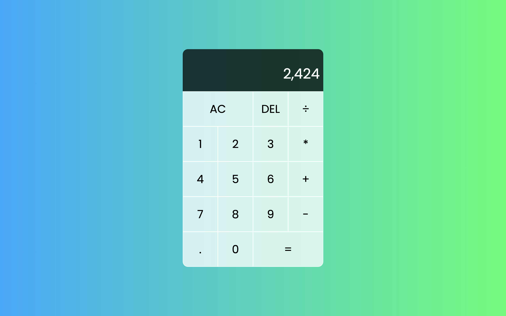

# Dicee Game

## Overview
This is a simple calculator project built using HTML, CSS, and JavaScript. The calculator provides basic arithmetic operations such as addition, subtraction, multiplication, and division. It has a user-friendly interface and is designed to be easily accessible.

## Screenshots


## How to Run
1. Clone the repository to your local machine.
   ```bash
   git clone https://github.com/akdevv/mini-web-projects.git
   cd mini-web-projects/calculator
   ```
2. Open the index.html file in your preferred web browser.

## File Structure
```
├── index.html
├── script.js
├── styles.css
├── README.md
└── screenshot.png
```

## Credits
This project was created with refrence to the YoutTube video by [**Web Dev Simplified!**](https://www.youtube.com/watch?v=j59qQ7YWLxw)
