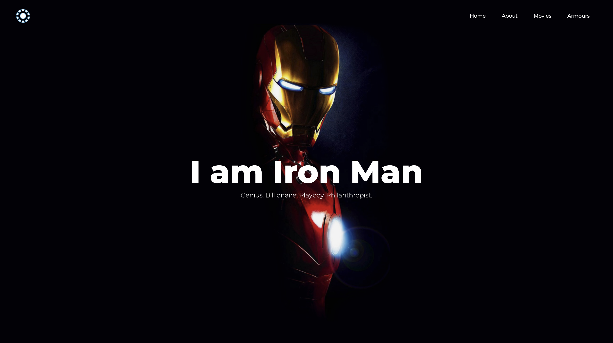
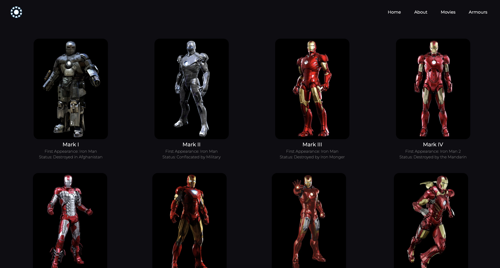

# Iron Man

## Overview
This is a tribute website dedicated to the legendary Iron Man. With a sleek landing page and concise about section, on our hero. It also contains a gallery of all the Iron Man armours ever shown in MCU along with all the movies in which he appeared. It was made purely with HTML & CSS.

## Screenshots

### Home Page


### Armours Page



## How to Run
1. Clone the repository to your local machine.
   ```bash
   git clone https://github.com/akdevv/mini-web-projects.git
   cd mini-web-projects/iron-man
   ```
2. Open the index.html file in your preferred web browser.

## File Structure
```
├── styles.css
├── about.html
├── armours.html
├── index.html
├── movies.html
├── README.md
└── images/
```

