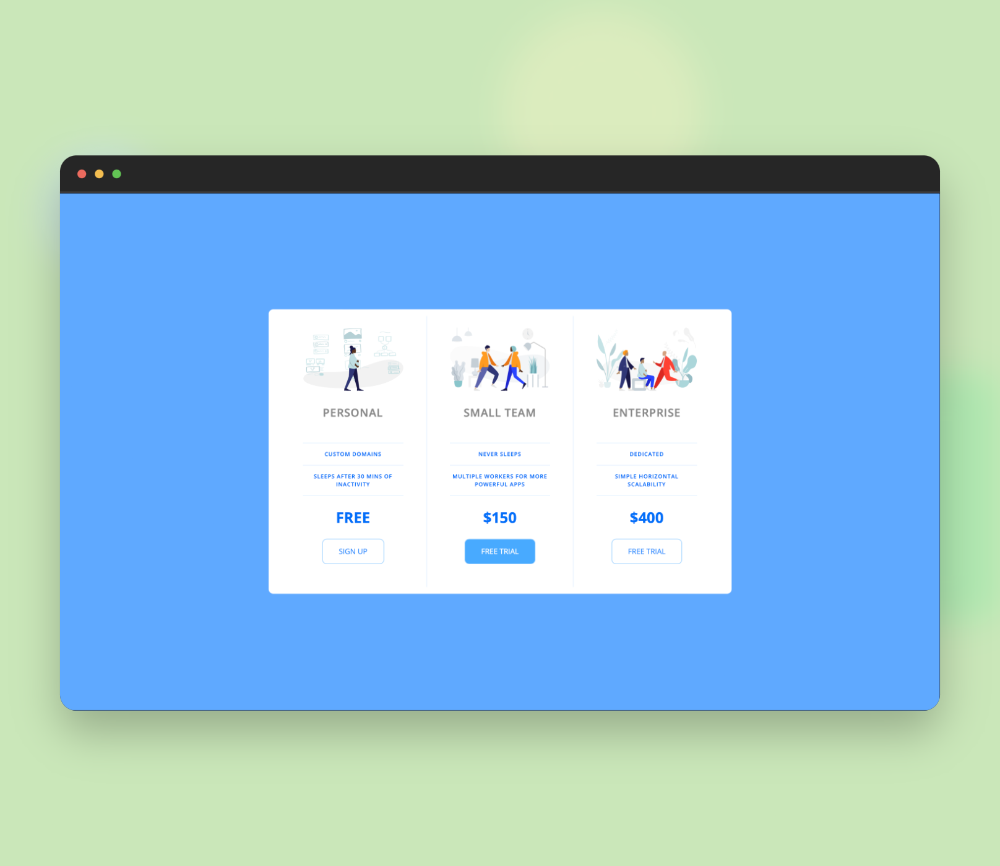

# Pricing Panel Website

## Overview
This project is a simple pricing panel website designed to showcase different price points for a service. It utilizes HTML and CSS to create a responsive layout.

## Screenshots

### Desktop View


### Mobile View


## How to Run
1. Clone the repository to your local machine.
   ```bash
   git clone https://github.com/akdevv/mini-web-projects.git
   cd mini-web-projects/pricing-panel
   ```
2. Open the index.html file in your preferred web browser.

## File Structure
```
├── app.css
├── index.html
├── README.md
├── icons
    ├── icon1.png
    └── icon2.png
    └── icon3.png
└── screenshots
    ├── desktop.png
    └── mobile.png
```

