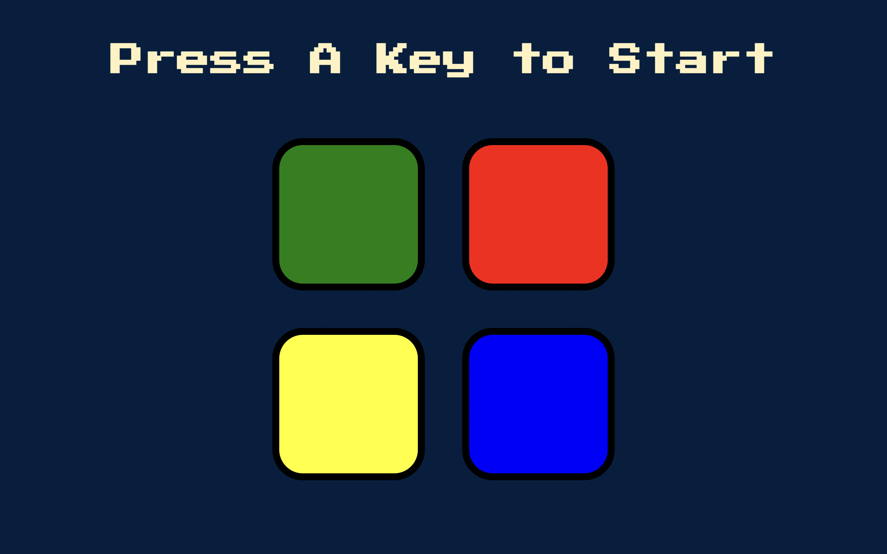

# Simon Game

## Overview
Simon is a classic electronic memory game designed to test and enhance the player's memory and pattern recognition skills.

## Screenshots


## How to Run
1. Clone the repository to your local machine.
   ```bash
   git clone https://github.com/akdevv/mini-web-projects.git
   cd mini-web-projects/simon-game
   ```
2. Open the index.html file in your preferred web browser.

## File Structure
```
├── index.html
├── script.js
├── styles.css
├── screentshot.png
├── README.md
└── sounds/
```

## Credits
This project was created with refrence to the Udemy course [The Complete 2024 Web Development Bootcamp](https://www.udemy.com/course/the-complete-web-development-bootcamp/) by **Angela Yu**.